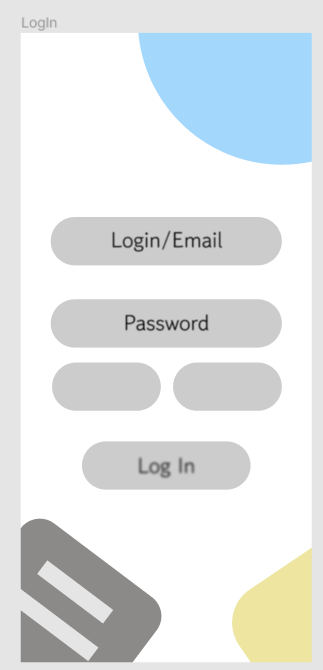
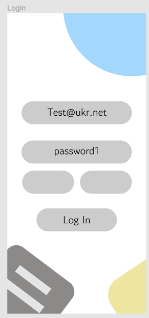
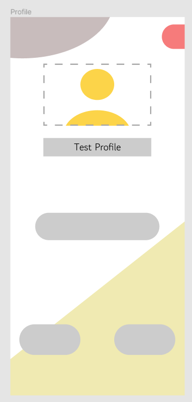

### Опис тестових сценаріїв нефункціональних вимог

| NFR ID | TC ID |                                             Опис кроків тестового сценарію                                            | Опис очікуваних результатів |
|:------:|:-----:|:---------------------------------------------------------------------------------------------------------------------:|-----------------------------|
| NFR1.1 | TC1.7 | Початкові умови: **відсутні** Кроки: **відсутні**                                                                  | Екран авторизації:           |
| NFR1.1 | TC1.8 | Початкові умови: **успішно пройдено TC1.7** Кроки: 1) login_email = "Test@ukr.net" 2) password = "password1" | Екран авторизації: |
| NFR1.1 | TC1.9 | Початкові умови: **успішно пройдено TC1.8** Кроки: 1) Натиснути кнопки "Log In"                                 | Екран авторизації: |
